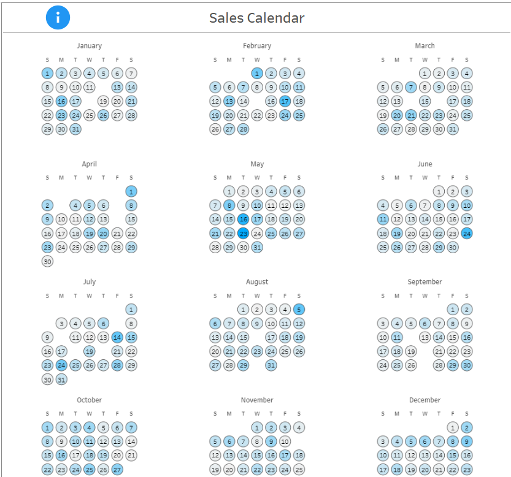

# Sales Calendar Dashboard

A visual sales calendar built in Tableau that displays daily sales performance in an intuitive calendar format, enabling quick identification of sales patterns, trends, and anomalies throughout the year.


## 📊 Live Dashboard

**[View on Tableau Public](https://public.tableau.com/app/profile/daria.savvateeva/viz/SalesCalendar_17405804938280/Dashboard1)**

---

## 🖼️ Dashboard Preview



*Interactive calendar view showing sales performance across all 12 months with color-coded daily values*

---

## 💼 Business Value

### Why a Sales Calendar?

Traditional line charts and bar graphs can make it difficult to spot day-of-week patterns or specific date anomalies. A calendar view provides:

- **Instant Pattern Recognition**: Quickly identify which days of the week consistently perform well or poorly
- **Seasonal Insights**: Spot trends across weeks and months at a glance
- **Anomaly Detection**: Easily identify unusual spikes or drops on specific dates
- **Executive Communication**: Intuitive format that stakeholders immediately understand
- **Planning Support**: Align marketing campaigns, promotions, and resource allocation with historical patterns

### Use Cases

1. **Retail**: Identify peak shopping days and plan inventory accordingly
2. **Sales Teams**: Set realistic daily targets based on historical performance
3. **Marketing**: Schedule campaigns around high-performance days
4. **Operations**: Plan staffing levels based on expected sales volume
5. **Finance**: Forecast revenue with day-level granularity

---

## ✨ Key Features

- **Full Year View**: All 12 months displayed simultaneously
- **Color-Coded Performance**: Sales values represented by color intensity
- **Hover Details**: Tooltip shows exact sales value and monthly trend
- **Interactive Filtering**: Filter by year to compare different periods
- **Weekday Labels**: Clear S-M-T-W-T-F-S headers for each month
- **Trend Analysis**: Hover over month name to see sales trend line

---

## 🛠️ How It Works

This calendar is built using Tableau's spatial functions (`MAKEPOINT`) to position each date as a circle in a grid layout. The technique involves:

1. **Creating a coordinate system** using week numbers and weekdays
2. **Positioning each date** as a point in 2D space
3. **Organizing into quarters** to display 3 months per row
4. **Color-coding by sales value** for visual analysis
5. **Adding interactive tooltips** with trend sparklines

### Technical Highlights

- Uses `MAKEPOINT()` function to create spatial coordinates
- Custom calculated fields for week offset and weekday positioning
- Fixed-level-of-detail (LOD) calculations for first week per month
- Multiple mark layers for dates, weekday labels, and month labels
- Integrated trend visualization in tooltips

---

## 📖 Step-by-Step Build Guide

### Prerequisites
- Tableau Desktop or Tableau Public
- Dataset with: Date field and Sales/Revenue metric
- Sample data structure:
  ```
  Date        | Sales
  ------------|--------
  2017-01-01  | 2500
  2017-01-02  | 3200
  ...         | ...
  ```

### Data Preparation
Before starting, ensure your data has:
- A **Date** field (any date format)
- A **Sales** or revenue metric (numeric)
- Ideally one year or more of daily data

---

### Step 1: Create Base Date Calculations

#### 1.1 Month Name
```tableau
DATENAME('month', [Date])
```

#### 1.2 Month Grouping
1. Put `Month Name` on Rows
2. Select January, April, July, October together
3. Right-click → Create Group (clip icon)
4. Right-click new group → Edit Alias → Name it "1"
5. Repeat for other month groups:
   - Group 2: February, May, August, November
   - Group 3: March, June, September, December

#### 1.3 Quarter Date
1. Put `Month Name (group)` on Columns
2. Put `Date` on Rows → Select **discrete Quarter**

#### 1.4 Weekday
1. Put `Date` on Columns → Select **WEEKDAY** (discrete)

---

### Step 2: Create Week Positioning Calculations

#### 2.1 First Week per Month (LOD Calculation)
```tableau
{FIXED DATETRUNC('month', [Date]): MIN(DATEPART('week', [Date]))}
```
- Move this calculation to **Dimensions**
- Drag to Rows

#### 2.2 Week Offset
```tableau
-(DATEPART('week', [Date]) - [First Week per Month])
```
**Note**: Negative sign flips the calendar right-side up

- Move to **Dimensions**
- Drag to Rows

#### 2.3 Clean Up Rows
- Remove `WEEK(Date)` from Rows
- Remove `First Week per Month` from Rows

---

### Step 3: Create Weekday Positioning

#### 3.1 Weekday #
```tableau
DATEPART('weekday', [Date])
```

**For non-US locales** (if Monday is first day of week):
```tableau
IF DATEPART('weekday', [Date]) = 1 
THEN 7 
ELSE DATEPART('weekday', [Date]) - 1 
END
```

- Move to **Dimensions**
- Drag to Columns

---

### Step 4: Build the Calendar Grid

#### 4.1 Create Main Calendar Sheet
1. Create new worksheet
2. Add `YEAR(Date)` to Filters → Select desired year

#### 4.2 Day Point Calculation
```tableau
MAKEPOINT([Week Offset], [Weekday #])
```
*This treats Week Offset as latitude and Weekday # as longitude*

#### 4.3 Arrange Layout
1. Double-click `Day Point` calculation
2. Put `Month Name (group)` on Columns
3. Put discrete `QUARTER(Date)` on Rows

---

### Step 5: Add Date Labels

1. Put `Date` on Label → Select **discrete DAY**
2. Change mark type to **Circle**
3. Increase circle size using Size shelf

---

### Step 6: Add Color by Sales

1. Drag `Sales` to Color
2. Click Color → Remove Halo
3. Click Color → Add dark Border to circles

---

### Step 7: Format Labels

1. Click Label → Align text to center
2. Adjust font size as needed

---

### Step 8: Add Weekday Labels

#### 8.1 Create Weekday Label Calculation
```tableau
MAKEPOINT(1, [Weekday #])
```
- Drag to Marks card (creates new layer)

#### 8.2 Configure Weekday Layer
1. Change mark type to **Text**
2. Put `Date` on Text → Select **WEEKDAY** (discrete)
3. Right-click `WEEKDAY(Date)` → Format → Pane → **First Letter** only
4. Remove Halo background

---

### Step 9: Add Month Labels

#### 9.1 Create Month Label Calculation
```tableau
MAKEPOINT(2, 4)
```
*2 = above weekday labels, 4 = centered*

- Drag to Marks card (creates new layer)

#### 9.2 Configure Month Layer
1. Change mark type to **Text**
2. Put `Month Name` on Text
3. Remove Halo background

---

### Step 10: Add Trend Tooltip

#### 10.1 Create Trend Sheet
1. Create new worksheet
2. Put continuous `Date` on Columns
3. Put `Sales` on Rows

#### 10.2 Link to Calendar
1. Go back to Calendar sheet
2. Add `Sales` to Detail
3. Add `Date` (Month/Year option) to Detail

#### 10.3 Configure Tooltips
For Month Label layer:
```
Month: <Month Name>
Total Sales: <SUM(Sales)>

Hover to see trend
[Insert Sheet: Trend Sheet]
```

For Day Point layer:
```
Date: <DAY(Date)> <DATENAME('month', Date)>
Sales: <Sales>

Monthly trend:
[Insert Sheet: Trend Sheet]
```

---

### Step 11: Final Formatting

#### 11.1 Hide Headers
- Right-click `Month Name (group)` on Columns → Uncheck "Show Header"
- Right-click `QUARTER(Date)` on Rows → Uncheck "Show Header"

#### 11.2 Remove Borders
1. Format → Borders
2. Row Divider: **None**
3. Column Divider: **None**

#### 11.3 Clean Map Background
1. Map → Map Layers
2. Adjust opacity or disable background map
3. Washout map elements

---

## 🎨 Customization Ideas

- **Change Color Scheme**: Use diverging colors for above/below target
- **Add Target Lines**: Show daily target values
- **Multiple Metrics**: Create separate calendars for units sold, profit, etc.
- **Comparative View**: Side-by-side calendars for year-over-year comparison
- **Annotations**: Add notes for promotions, events, or anomalies

---

## 📊 Files Included

```
sales-calendar-tableau/
├── data/
│   └── [your-sales-data].csv        # Sample sales data
├── dashboards/
│   └── Sales_Calendar.twbx          # Tableau workbook
├── screenshots/
│   └── sales_calendar.png           # Dashboard preview
├── .gitignore
├── LICENSE
└── README.md                        # This file
```

---

## 🚀 Getting Started

### Prerequisites
- Tableau Desktop or Tableau Public
- Dataset with: Date field and Sales/Revenue metric
- Sample CSV data is included in the `data/` folder

### View Online
Simply visit the [Tableau Public link](https://public.tableau.com/app/profile/daria.savvateeva/viz/SalesCalendar_17405804938280/Dashboard1) to interact with the dashboard.

### Download and Modify
1. Download `Sales_Calendar.twbx` from the `dashboards/` folder
2. Use the sample data from `data/` folder or connect to your own data
3. Open in Tableau Desktop or Tableau Public
4. Adjust calculations as needed

---

## 💡 Tips & Tricks

### Common Issues

**Issue**: Calendar is upside down  
**Solution**: Add negative sign to Week Offset calculation

**Issue**: Week starts on wrong day  
**Solution**: Adjust Weekday # calculation for your locale

**Issue**: Months not aligned  
**Solution**: Check Month Name grouping - should be 3 groups of 4 months

**Issue**: Circles overlapping  
**Solution**: Ensure Week Offset and Weekday # are in Dimensions, not Measures

---

## 🎯 Learning Objectives

By building this calendar, you'll learn:
- Advanced spatial functions (`MAKEPOINT`)
- LOD (Level of Detail) calculations
- Multi-layer mark cards
- Custom tooltip formatting
- Creative data visualization techniques

---

## 📈 Potential Extensions

- **Weekly Aggregation**: Show week-level totals instead of daily
- **Multiple Years**: Small multiples showing several years
- **Forecast Integration**: Add predicted values for future dates
- **Goal Tracking**: Overlay daily/weekly targets
- **Drill-Down**: Click date to see transaction details

---

## 🤝 Contributing

Have ideas for improvements? Found a bug in the calculations? Feel free to:
- Open an issue
- Submit improvements
- Share your customized version

---

## 📄 License

This project is available under the MIT License - feel free to use and modify for your own purposes.

---

## 👤 Author

**Daria Savvateeva**
- Tableau Public: [@daria.savvateeva](https://public.tableau.com/app/profile/daria.savvateeva)
- GitHub: [@DariaSavva](https://github.com/DariaSavva)

---

## 🙏 Acknowledgments

- Inspiration from various Tableau calendar visualizations in the community
- Technique adapted from Tableau spatial analysis methods

---

**Built with Tableau | Last Updated: January 2025**
